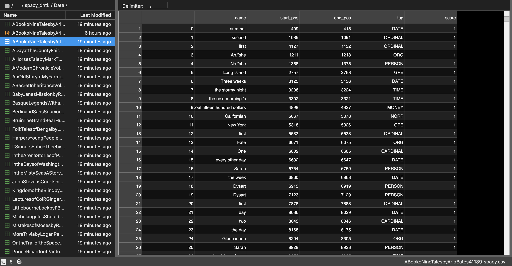

# Spacy DHTK  

## Introduction  

Spacy is a Python parser for books. This project was realised during the class “Object Oriented Programming in Python” teached by Davide Picca and assisted by Coline Métrailler.  

The code was created by : Jason Ola, Gislain Delavy, Victor Vermot-Petit-Outhenin and Caroline Roxana Rohrbach.

University of Lausanne – Spring 2020

The database is based on 50 English books in plain text format (.txt) from the Project Gutenberg website : http://www.gutenberg.org/.  

The generated JSON scripts are located in the generated_json folder.  

## Dependencies
- Python 3

## Objective 

The objective of the project is to work with texts from Gutenberg.org, using spaCy, a free open-source library for Natural Language Processing (NLP) in Python. It is used to analyse texts by using linguistic features thanks to the NLP (Natural Language Processing).

To do so, three dataclass were created : 
`Book`, `Character` ,`Line`.

The main dataclass, `Book`, import the other dataclass and stores a main portion of our code.

The dataclass `Character` stores methodes that end up returning a dictionnary of the characters of a book paired with the paragraphs they appear in. 

The dataclass `Line` corresponds to the tagging of paragraphs using spaCy’s NLP.

The code to generate the JSON files can be found in the `main.py`script. 

## Procedure 
The first step of the creation of this code was the division of the three data classes below. Then we created the methods which are the following : 
`Book`:
The method `get_name()` returns the name of the book then `get_lines()` divides the text in lines.
The three following methods return a Dataframe and creates a csv file with an array of the informations : 
- `spacy_pos_tagging()`separates the text in words and give information about their grammatical or syntaxical features. 
- `spacy_get_dependencies()`is a method that uses the NLP of the text and returns the dependencies between words in a book. 
- `spacy_df_pipe()` is a method that returns entities of a text, giving informations that can be seen below on the screenshot.
`Character`
The method `spacy_characters()` allows access to a dictionary of characters and their number of occurrences in the text per paragraph.

## Results 
The results are stored in JSON files thanks to the script in the `main.py` file. We initiated an instance of the class `Book`, giving it the path to .txt files as an argument. Then, using the `spacy_df_pipe`method, we store all the data in two different folders.

All of those informations can be found as json files in the `generated_json` folder. They can also be found as csv files in the `Data`folder.

Here is a screenshot of a generated dataframe : 

